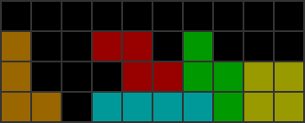

============================================================
コマンド: sequence
============================================================

Alias command: seq

概要
============================================================

ミノの置き場所を指定したとき、最後までその通りに置くことができるミノ順をすべて列挙します。

また、置き場所を複数個同時に指定することで、パターン全体のうちカバーできる確率を表示します。

結果は CSVファイル で出力されます。

基本コマンド
============================================================

``java -jar sfinder.jar sequence --tetfu v115@vhFRQJUGJKJJvMJTNJGBJ v115@vhFRQJPGJKJJGMJTNJ0BJ --patterns *p7``

入力フォーマット
============================================================

組み方について
^^^^^^^^^^^^^^^^^^^^^^^^^^^^^^^^^^^^^^^^^^^^^^^^^^^^^^^^^^^^^

[サンプル v115@vhERQJUGJKJJvMJTNJ](http://fumen.zui.jp/?v115@vhERQJUGJKJJvMJTNJ)

組み方の入力は、「テト譜」のみ対応しています。

入力するテト譜は、1ページごとにミノを配置して、接着フラグをオンにしてください。

接着フラグがオンになっていないミノや、途中で直接ブロックが書き加えられた地形は反映されないため、ご注意ください。

ページ指定について
^^^^^^^^^^^^^^^^^^^^^^^^^^^^^^^^^^^^^^^^^^^^^^^^^^^^^^^^^^^^^

サンプル v115@vhERQJUGJKJJvMJTNJ#1:5

テト譜の末尾に `#x:y` を加えることでページを指定することができます。
ページ番号は、先頭のページが `1` となります。
また、最後に指定したページのミノも探索対象に含まれます。

* `#2:5`: 2ページから5ページまでの最大4ミノ
* `#:5`: `#1:5` と同様
* `#2:`: 最後のページが6ページの場合 `#2:6` と同様

補足: 置くミノよりも多いミノを、パターンとして入力した場合
^^^^^^^^^^^^^^^^^^^^^^^^^^^^^^^^^^^^^^^^^^^^^^^^^^^^^^^^^^^^^

|sample_001|

上の組み方に対して、パターンとして7種のミノすべて(`*p7`)を指定したとします、

このとき、`JT` を使わずに `ILSZO` を置くことができるパターンが成功となります。

ホールドが許可されている場合であれば `JILSZOT` は成功となります(`L` をホールドしたまま `ILSZO` を置けるため)。
`JTILSZO` は失敗となります(`JT` のどちらかは必ず置かなければならないため)。

出力フォーマット
============================================================

コンソール表示
^^^^^^^^^^^^^^^^^^^^^^^^^^^^^^^^^^^^^^^^^^^^^^^^^^^^^^^^^^^^^

サンプル ::

  # Output
  success:
  33.33 % [1680/5040]: http://fumen.zui.jp/?v115@vhFRQJUGJKJJvMJTNJGBJ#1:6
  44.44 % [2240/5040]: http://fumen.zui.jp/?v115@vhFRQJPGJKJJGMJTNJ0BJ#1:6
  >>>
  OR  = 61.67 % [3108/5040]
  AND = 16.11 % [812/5040]

x.xx % [yyyy/zzzz]
- x.xx: パターンごとに指定された組み方をできる確率
- yyyy: 組めるパターン数
- zzzz: パターン全体の数

OR: 指定された組み形のうち、どれかひとつでも組むことができるパターンの確率

AND: 指定された組み形のうち、すべてを組むことができるパターンの確率

CSV形式
^^^^^^^^^^^^^^^^^^^^^^^^^^^^^^^^^^^^^^^^^^^^^^^^^^^^^^^^^^^^^

サンプル ::

  sequence,vhFRQJUGJKJJvMJTNJGBJ,vhFRQJPGJKJJGMJTNJ0BJ
  TILJSZO,X,O
  TILJSOZ,X,O
  TILJZSO,X,O
  TILJZOS,X,O
  TILJOSZ,X,O
  TILJOZS,X,O
  TILSJZO,X,O
  TILSJOZ,X,O
  TILSZJO,O,O
  TILSZOJ,O,X

* TILJSZO: パターンで指定されたツモ順
* X: 組むことができない
* O: 組むことができる

オプション一覧
============================================================

======== ====================== ======================
short    long                   default
======== ====================== ======================
``-t``   ``--tetfu``            なし
``-p``   ``--patterns``         なし
``-H``   ``--hold``             use
``-d``   ``--drop``             softdrop
``-o``   ``--output-base``      output/path.txt
``-lp``  ``--log-path``         output/last_output.txt
``-fp``  ``--field-path``       input/field.txt
``-pp``  ``--patterns-path``    input/patterns.txt
======== ====================== ======================

``-t``, ``--tetfu`` [default: なし]
^^^^^^^^^^^^^^^^^^^^^^^^^^^^^^^^^^^^^^^^^^^^^^^^^^^^^^^^^^^^^

フィールドやオプションなどを指定したテト譜データを指定する。

テト譜で探索条件を指定する場合は ``--tetfu v115@vhAAgH`` のように指定する。

v115のテト譜データにのみ対応。

``-p``, ``--patterns`` [default: なし]
^^^^^^^^^^^^^^^^^^^^^^^^^^^^^^^^^^^^^^^^^^^^^^^^^^^^^^^^^^^^^

探索したいミノ順を指定する。

最大で22個のミノまで指定できる。

なお、renコマンドでは複数のミノを指定する記号（`*`, `[]`）は使用できません。

パターンを変更したい場合は ``--pattern IOSZLJTIO`` のように指定します。

``-H``, ``--hold`` [default: use]
^^^^^^^^^^^^^^^^^^^^^^^^^^^^^^^^^^^^^^^^^^^^^^^^^^^^^^^^^^^^^

ホールドの有無を指定する。

ホールドなしで探索する場合は ``--hold avoid`` を指定する。

``-d``, ``--drop`` [default: softdrop]
^^^^^^^^^^^^^^^^^^^^^^^^^^^^^^^^^^^^^^^^^^^^^^^^^^^^^^^^^^^^^

ミノの操作に制限を加える。

以下から操作方法をひとつ選択する。

* softdrop: ソフトドロップ＋回転入れ（制限なし）
* harddrop: ハードドロップのみ

``-o``, ``--output-base`` [default: output/ren.html]
^^^^^^^^^^^^^^^^^^^^^^^^^^^^^^^^^^^^^^^^^^^^^^^^^^^^^^^^^^^^^

出力結果を保存するファイルのパスを指定する。

``-lp``, ``--log-path`` [default: output/last_output.txt]
^^^^^^^^^^^^^^^^^^^^^^^^^^^^^^^^^^^^^^^^^^^^^^^^^^^^^^^^^^^^^

実行時のログを保存するファイルのパスを指定する。

``-fp``, ``--field-path`` [default: input/field.txt]
^^^^^^^^^^^^^^^^^^^^^^^^^^^^^^^^^^^^^^^^^^^^^^^^^^^^^^^^^^^^^

フィールドを定義するファイルのパスを指定する。

``-pp``, ``--patterns-path`` [default: input/patterns.txt]
^^^^^^^^^^^^^^^^^^^^^^^^^^^^^^^^^^^^^^^^^^^^^^^^^^^^^^^^^^^^^

探索の組み合わせパターンを定義するファイルのパスを指定する。

