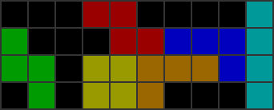

============================================================
コマンド: setup
============================================================

概要
============================================================

ある地形から指定したブロックを埋める操作手順をすべて列挙します。

そのとき、探索時に置いても置かなくても良い場所（マージンエリア）を指定することもできます。

探索結果は HTMLファイル で出力されます。

基本コマンド
============================================================

``java -jar sfinder.jar setup --tetfu v115@HhUpxhBeA81hCeA8yhD8AeB8JeAgH --patterns *! --fill i --margin o``

詳細
============================================================

.. |fumen_sample_002| image:: img/fumen_sample_002.png
   :scale: 50
.. |solution_sample_001| image:: img/solution_sample_001.png
   :scale: 50
.. |solution_sample_002| image:: img/solution_sample_002.png
   :scale: 50

.. |solution_sample_006| image:: img/solution_sample_006.png
   :scale: 50

|fumen_sample_001|

``java -jar sfinder.jar setup --tetfu v115@9gTpFeTpFeTpFezhPeAgH --fill I --margin O -p *! -c yes``

はじめに「必ず埋める場所」「マージンエリア」を指定します。

もしオプションで ``--fill I --margin O`` を指定した場合、次のように解釈されます。

* 水色のエリア → 探索時に必ず埋める必要がある場所
* 黄色のエリア → 探索時に置いても置かなくても良い場所（マージンエリア）
* グレーのエリア → 既にブロックが固定されたエリア

このとき、下のような結果が得られます。

|solution_sample_001|
|solution_sample_002|
|solution_sample_003|

また同時に、下のような結果も得られます。

|solution_sample_004|

このような「穴」が含まれる地形を取り除く場合は ``--exclude`` を設定してください。
``--exclude`` を設定することで、マージンエリアを含めて地形全体のどこかに「穴」のある解が
除外されます。

もし ``--exclude`` を設定しつつも、「穴」を許容するエリアを指定したい場合は ``--free`` で色を指定し、その色で地形を塗ってください。

----

次に、下の地形をもとに説明します。

|fumen_sample_002|

``java -jar sfinder.jar setup --tetfu v115@9gQpBewhVpwhCe3hAe2hZpJeAgH --patterns [^T]! --fill I --margin O -c yes``

このとき、下のようなT以外のミノを使ってできる地形が列挙されます。

|solution_sample_005|
|solution_sample_006|

この解にはどちらも「穴」が含まれているため、そのまま ``--exclude`` を設定するとどちらの解も除外されてしまいます。

それを防ぐため、解が除外される前に「ミノを置く」「1ライン全て埋める」などの操作を行うことができます。
詳細は  ``--operate`` オプションをご参照ください。

この例では ``--operate "T-Reverse(2,2)"`` で1つめの解を取り出すことができます。

----

最後に、入力パターン ``--patterns`` について補足します。

デフォルトでは ``--patterns`` で入力したミノは「ミノ順」として解釈されます。

このとき、解にはすべてのミノを使用した解が表示されます。
また、ミノ順の関係で組むことができない解は表示されません。

たとえば パターンに ``IOOI`` を指定したとき、2つめのI は O より後に置かれます。

もし、この入力パターンを「ミノの組み合わせ」として解釈したい場合は ``--combination yes`` を設定してください。
たとえば、パターンに ``IOOI`` を指定したとき、置く順番に関わらず I2個・O2個 を使用した解が表示されます。

``--combination yes`` のときに表示される解は「必ず埋めるエリア ``--fill``」をカバーする最小限のミノが表示されます。
置くミノの個数を固定したい場合は ``--n-pieces`` を設定してください。

フィールドの指定方法
============================================================

テト譜から入力するとき
^^^^^^^^^^^^^^^^^^^^^^^^^^^^^^^^^^^^^^^^^^^^^^^^^^^^^^^^^^^^

.. |fumen_sample_003| image:: img/fumen_sample_003.png
   :scale: 50

|fumen_sample_003|

``java -jar sfinder.jar setup -t v115@9gV4whCe1hCeA82hAeB8XpA8KeAgH --fill I --margin O --free S -p [^T]! -op "T-Reverse(7,2)" -e holes``

オプションで「必ず埋める場所」「マージンエリア」「フリーエリア」の色を指定してください。

* ``-f`` or ``--fill`` → 探索時に必ず埋める必要がある場所
* ``-m`` or ``--margin`` → 探索時に置いても置かなくても良い場所（マージンエリア。``exclude`` 設定時には穴を許容しない）
* ``-F`` or ``--free`` → マージンエリア かつ 常に穴を許容するエリア

フィールドファイルから入力するとき
^^^^^^^^^^^^^^^^^^^^^^^^^^^^^^^^^^^^^^^^^^^^^^^^^^^^^^^^^^^^

入力例 ::

  ++++++*___
  ******___X
  *******_XX
  ........X_

``java -jar sfinder.jar setup --patterns [^T]! --operate "T-Reverse(7,2)" --exclude holes``

通常のフィールドの定義に「必ず埋める場所」「マージンエリア」を指定します。

* ``*`` → 探索時に必ず埋める必要がある場所
* ``.`` → 探索時に置いても置かなくても良い場所（マージンエリア。``--exclude`` 設定時には穴を許容しない）
* ``+`` → マージンエリア かつ 常に穴を許容するエリア

.. note::

  フィールドファイル1行目の数字は必須ではありません。
  もし数字を記載した場合は ``--line`` オプションとして解釈されます。

出力フォーマット
============================================================

出力フォーマットは、以下の方式から選択できます。
変更したい場合は、オプションから変更できます。

* html: シンプルなHTML形式のテト譜リンク
* csv: csv形式（詳細は後述）

HTML形式
^^^^^^^^^^^^^^^^^^^^^^^^^^^^^^^^^^^^^^^^^^^^^^^^^^^^^^^^^^^^^

サンプル ::

  2202433332

  __________
  ____X_____
  ____XXXXX_
  XX_XXXXXXX
  XX_XXXXXXX

  ZIOSLJT [462] (Link: http://fumen.zui.jp/?v115@5gwwGeg0ywFeg0ilQ4AeRpAeh0glBtR4RpAezhBtQ4?JeAgWHAauytCs/1BA)
  ZIOSLJT [455] (Link: http://fumen.zui.jp/?v115@8gwwDeg0CexwDeg0ilQ4wwRpAeh0glBtR4RpAezhBt?Q4JeAgWHAauytCs/1BA)
  ZIOSLJT [357] (Link: http://fumen.zui.jp/?v115@6gwwFeg0AeywEeg0ilQ4AeRpAeh0glBtR4RpAezhBt?Q4JeAgWHAauytCs/1BA)

``2202433332`` の数字は、列ごとのブロック数を左から並べたものです。

数字の下の ``____X_____〜`` は、地形を簡易的に表示したものです。
ここには ``--fill`` をカバーする最低限の地形が表示されます。

地形の下の ``ミノ順＋リンク`` は、テト譜へのリンクを表示しています。
もし「``--combination`` がオフ」 or 「``--n-pieces`` が設定されている」ときは、すべてのミノを利用したテト譜が表示されます。
したがって「テト譜」と「簡易的な地形表示」が異なる場合があります。ご注意ください。

リンクの後ろの数字 (462, ...) はこの地形を積み込む手順の総数で、入力パターンには依存しません。
手順は同じ種類のミノが複数個あっても、置く場所によってそれぞれ区別されます。
たとえば `T3個だけを使う地形 <http://fumen.zui.jp/?v115@QhwwAewwCewwBe0wAeywBewwJeAgH>`_ の場合、3!=6 通り となります。

CSV形式
^^^^^^^^^^^^^^^^^^^^^^^^^^^^^^^^^^^^^^^^^^^^^^^^^^^^^^^^^^^^^

地形をキーして、それぞれの地形で使用されるミノとその地形を組む全手順数を出力します。

出力例) ``setup -p *! --fill i --margin o -t v115@2gWpCeWpDe0hQpxhAe4hAe2hJeAgH --format csv`` ::

    地形,使用ミノ,手順数
    http://fumen.zui.jp/?v115@4gAtHeBtBewwEeAtglQ4xwg0RpAeilR4wwg0RpAezh?Q4h0JeAgWHAKNmFDMuqBA,JSTZLIO,420

各項目は、左から順に以下の通りです。
以下の 例) は、上記の結果を基づいた説明になります。

* テト譜
    - 地形を表すテト譜
    - 例)
        * ``http://fumen.zui.jp/?v115@4gAtHeBtBewwEeAtglQ4xwg0RpAeilR4wwg0RpAezh?Q4h0JeAgWHAKNmFDMuqBA``

* 使用ミノ
    - その地形で使用するミノの組み合わせ
    - 例)
        * ``JSTZLIO`` JSTZLIOの7ミノを使った地形である

* 手順数
    - その地形を積み込む手順の総数で、入力パターンには依存しません。
    - 手順は同じ種類のミノが複数個あっても、置く場所によってそれぞれ区別されます
        + たとえば `T3個だけを使う地形 <http://fumen.zui.jp/?v115@QhwwAewwCewwBe0wAeywBewwJeAgH>`_ の場合、3!=6 通り となります
    - 例)
        * ``420`` その地形を組む手順が 420通り

オプション一覧
============================================================

======== ====================== ======================
short    long                   default
======== ====================== ======================
``-t``   ``--tetfu``            なし
``-P``   ``--page``             1
``-p``   ``--patterns``         なし
``-c``   ``--combination``      no
``-f``   ``--fill``             なし
``-m``   ``--margin``           なし
``-F``   ``--free``             なし
``-l``   ``--line``             -1
``-H``   ``--hold``             use
``-d``   ``--drop``             softdrop
``-e``   ``--exclude``          none
``-op``  ``--operate``          なし
``-np``  ``--n-pieces``         -1
``-fo``  ``--format``           html
``-s``   ``--split``            no
``-o``   ``--output-base``      output/path.txt
``-lp``  ``--log-path``         output/last_output.txt
``-fp``  ``--field-path``       input/field.txt
``-pp``  ``--patterns-path``    input/patterns.txt
======== ====================== ======================

``-t``, ``--tetfu`` [default: なし]
^^^^^^^^^^^^^^^^^^^^^^^^^^^^^^^^^^^^^^^^^^^^^^^^^^^^^^^^^^^^^

フィールドやオプションなどを指定したテト譜データを指定する。

テト譜で探索条件を指定する場合は ``--tetfu v115@vhAAgH`` のように指定する。

v115のテト譜データにのみ対応。

``-P``, ``--page`` [default: 1]
^^^^^^^^^^^^^^^^^^^^^^^^^^^^^^^^^^^^^^^^^^^^^^^^^^^^^^^^^^^^^

テト譜でロードするページを指定する。

ページを変更したい場合は ``--page 31`` のように指定する。

``-p``, ``--patterns`` [default: なし]
^^^^^^^^^^^^^^^^^^^^^^^^^^^^^^^^^^^^^^^^^^^^^^^^^^^^^^^^^^^^^

探索したいミノのパターンを指定する。

パターンを変更したい場合は ``--pattern *p7`` のように指定する。

もし ``--combination`` が設定されていない場合は「ミノ順」として、設定されているときは「ミノの組み合わせ」として解釈されます。

``-c``, ``--combination`` [default: no]
^^^^^^^^^^^^^^^^^^^^^^^^^^^^^^^^^^^^^^^^^^^^^^^^^^^^^^^^^^^^^

``yes`` を指定した場合、入力されたパターンを「ミノ順」ではなく「ミノの組み合わせ」として解釈します。

たとえば パターンに ``IOOI`` を指定したとき、

``no`` では、2つめのI は O より後に置く必要がありますが、

``yes`` では、置く順番に関わらず I2個・O2個 を使用した解が表示されます。

``-f``, ``--fill`` [default: なし]
^^^^^^^^^^^^^^^^^^^^^^^^^^^^^^^^^^^^^^^^^^^^^^^^^^^^^^^^^^^^^

フィールドをテト譜から入力するとき、必ず埋めるエリアとするブロックの色を指定する。

このオプションで指定した色が、探索時に必ず任意のミノを置く場所と解釈されます。
なお、色は ``TOI`` のように複数個同時に指定できます。

色の指定値は、以下のようになります（大文字・小文字はどちらでも良い）。

* ``I`` or ``cyan`` or ``cy`` → Iブロック
* ``J`` or ``blue`` or ``bl`` → Jブロック
* ``L`` or ``orange`` or ``or`` → Lブロック
* ``O`` or ``yellow`` or ``ye`` → Oブロック
* ``S`` or ``green`` or ``gr`` → Sブロック
* ``Z`` or ``red`` or ``re`` → Zブロック
* ``T`` or ``purple`` or ``pu`` → Tブロック
* ``none`` → 指定なし（マージンエリアなし）

``-m``, ``--margin`` [default: なし]
^^^^^^^^^^^^^^^^^^^^^^^^^^^^^^^^^^^^^^^^^^^^^^^^^^^^^^^^^^^^^

フィールドをテト譜から入力するとき、マージンエリアとするブロックの色を指定する。

このオプションで指定した色が、探索時に置いても置かなくても良い場所と解釈されます。

もし ``--exclude`` オプションが指定されているとき、このエリア内の穴は除外対象となります。

色の指定値は ``--fill`` オプションを参照してください。

``-F``, ``--free`` [default: なし]
^^^^^^^^^^^^^^^^^^^^^^^^^^^^^^^^^^^^^^^^^^^^^^^^^^^^^^^^^^^^^

フィールドをテト譜から入力するとき、マージンエリアとするブロックの色を指定する。

このオプションで指定した色が、探索時に置いても置かなくても良い場所と解釈されます。

もし ``--exclude`` オプションが指定されている場合でも、このエリア内の穴は除外対象となりません。

色の指定値は ``--fill`` オプションを参照してください。

``-l``, ``--line`` [default: -1]
^^^^^^^^^^^^^^^^^^^^^^^^^^^^^^^^^^^^^^^^^^^^^^^^^^^^^^^^^^^^^

入力するフィールドの最大ライン数（高さ）を指定する。

指定したライン数よりも上にあるブロックは無視されます。

なお ``-1`` を指定した場合は ``最も高いフィールドの高さ`` が自動的に設定される。

``-H``, ``--hold`` [default: use]
^^^^^^^^^^^^^^^^^^^^^^^^^^^^^^^^^^^^^^^^^^^^^^^^^^^^^^^^^^^^^

ホールドの有無を指定する。

ホールドなしで探索する場合は ``--hold avoid`` を指定する。

``-d``, ``--drop`` [default: softdrop]
^^^^^^^^^^^^^^^^^^^^^^^^^^^^^^^^^^^^^^^^^^^^^^^^^^^^^^^^^^^^^

ミノの操作に制限を加える。

以下から操作方法をひとつ選択する。

* softdrop: ソフトドロップ＋回転入れ（制限なし）
* harddrop: ハードドロップのみ
* 180: ソフトドロップ＋180度回転入れ。180度回転は `Nullpomino <https://github.com/nullpomino/nullpomino>`_ のStandard Wallkickに準拠します。
* t-softdrop: Tミノはソフトドロップ、その他のミノはハードドロップ

``-e``, ``--exclude`` [default: none]
^^^^^^^^^^^^^^^^^^^^^^^^^^^^^^^^^^^^^^^^^^^^^^^^^^^^^^^^^^^^^

地形に「穴」が含まれる解を除外します。

除外する対象をひとつ選択してください。

* holes: ある空白ブロックに対して、その上にブロックがあれば「穴」として除外する（横に隙間がある場合でも除外されます）
* strict-holes: ある空白ブロックに対して、どうやっても到達できない場合は「穴」として除外する（四方がブロックで囲まれているとき）
* none: 除外なし

``-op``, ``--operate`` [default: なし]
^^^^^^^^^^^^^^^^^^^^^^^^^^^^^^^^^^^^^^^^^^^^^^^^^^^^^^^^^^^^^

除外対象を決定する前に、解の地形に対して操作を行う。

ここでの操作は、あくまで ``--exclude`` の判定 に利用するためであり、解の表示には影響は与えません。

以下の操作を指定することができます。

* 1ブロックを置く

  * block(1,2)：(x=1,y=2)にブロックを置く

* ミノを置く

  * I-Spawn(1,0)：出現時の回転のIミノを、回転軸(x=1,y=0)に置く
  * T-Reverse(4,2)：裏返したTミノを回転軸(x=4,y=2)に置く
  * L-Right(0,1)：右回転Lミノを回転軸(x=0,y=1)に置く
  * J-Left(9,1)：左回転Jミノを回転軸(x=9,y=1)に置く

* 1ラインすべてを埋める

  * row(1)：2段目をすべてブロックで埋める。この時点でライン消去はされません

* ライン消去を行う

  * clear()：ブロックで埋まっているラインを消去する

座標は左下のブロックが (0,0) となります。

ミノの回転軸は `SRS / How Guideline SRS Really Works <https://harddrop.com/wiki/SRS#How_Guideline_SRS_Really_Works>`_ の回転軸に準拠しています。

すべての操作が終わった後、自動的にライン消去（clear()）が行われます

.. note::

  複数個の操作を指定した場合は、先頭の操作から順に行われます。

  例）--operate "L-Right(0,1)" "row(1)" "clear()" "block(1,1)"

  `結果 <http://fumen.zui.jp/?v115@vhAKJYYAF7IVCNbNyDIP98AYo78ADq78A5nY9ARhg0?I8TeAAPQAF7YVEvT98A4p78A5nY9AvhAAAPRAF7wiDs4DXE?FbuRAy178ASAAAAShA8beAAPWAF7YfDsng/DFbO6AFLn6AF?rwRASbAAARhg0Ieh0ReAAPGASY0hEM/BAA>`_：右回転Lを置く→2段目をすべて埋める→ライン消去を行う→(1,1)にブロックを置く

``-np``, ``--n-pieces`` [default: -1]
^^^^^^^^^^^^^^^^^^^^^^^^^^^^^^^^^^^^^^^^^^^^^^^^^^^^^^^^^^^^^

解で使用されるミノの個数を指定する。

もし ``-1`` を指定した場合は自動で設定されます。（``--combination`` がオンのとき固定なし、オフのときはpatterns・地形に従う）

``-fo``, ``--format`` [default: html]
^^^^^^^^^^^^^^^^^^^^^^^^^^^^^^^^^^^^^^^^^^^^^^^^^^^^^^^^^^^^^

以下の出力フォーマットのうち、ひとつを指定する。

* html
* csv

``-s``, ``--split`` [default: no]
^^^^^^^^^^^^^^^^^^^^^^^^^^^^^^^^^^^^^^^^^^^^^^^^^^^^^^^^^^^^^

出力フォーマットがlinkのときに出力されるテト譜で、手順を1ミノずつ分割するか指定する。

ただし ``yes`` で生成されるテト譜はあくまで置き場所を示すものであり、ページ順通りに置くとミノが空中に浮いたり、移動できない場所に置かれることもあります。

* yes: 1ページにつき1ミノずつ表示される形で出力
* no: すべてのミノが1ページに納まった形で出力

``-o``, ``--output-base`` [default: output/setup.html]
^^^^^^^^^^^^^^^^^^^^^^^^^^^^^^^^^^^^^^^^^^^^^^^^^^^^^^^^^^^^^

出力結果を保存するファイルのパスを指定する。

``-lp``, ``--log-path`` [default: output/last_output.txt]
^^^^^^^^^^^^^^^^^^^^^^^^^^^^^^^^^^^^^^^^^^^^^^^^^^^^^^^^^^^^^

実行時のログを保存するファイルのパスを指定する。

``-fp``, ``--field-path`` [default: input/field.txt]
^^^^^^^^^^^^^^^^^^^^^^^^^^^^^^^^^^^^^^^^^^^^^^^^^^^^^^^^^^^^^

フィールドを定義するファイルのパスを指定する。

``-pp``, ``--patterns-path`` [default: input/patterns.txt]
^^^^^^^^^^^^^^^^^^^^^^^^^^^^^^^^^^^^^^^^^^^^^^^^^^^^^^^^^^^^^

探索の組み合わせパターンを定義するファイルのパスを指定する。
