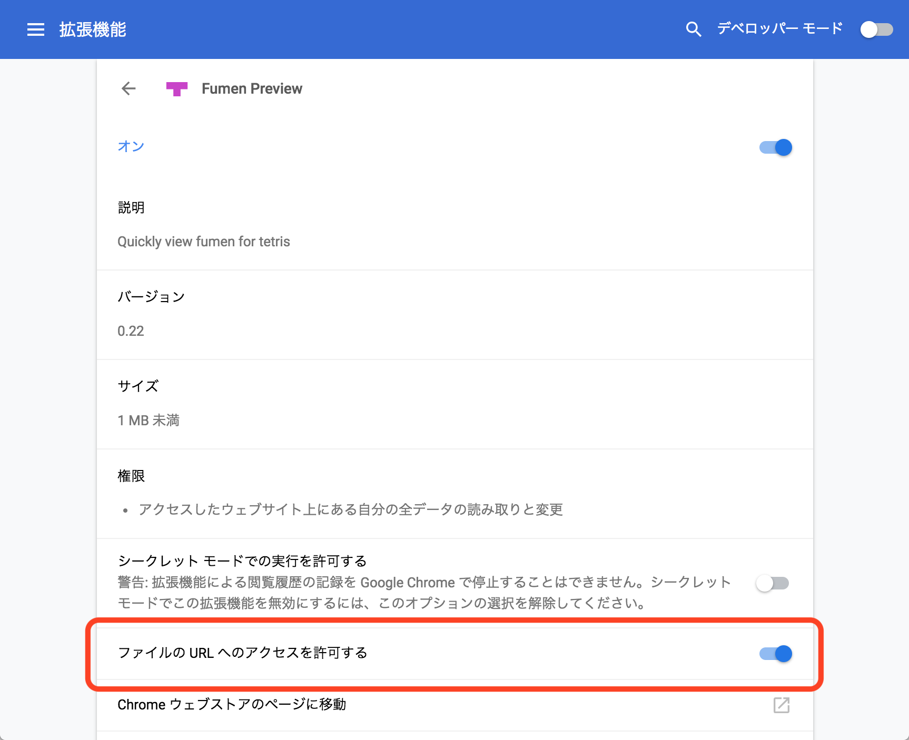

============================================================
関連ツール
============================================================

このページについて
============================================================

solution-finderと併用すると便利なツールを記載します。

Fumen Preview (Chrome Extension)
============================================================

.. |preview_video_001| image:: img/extension/video1.gif
   :scale: 50

solution-finderが出力するHTMLファイルのテト譜を開くことなく確認できるChrome拡張機能を別途公開しています。

|preview_video_001|

現在はChrome Web Storeから削除されていますが、
`こちら <https://github.com/knewjade/fumen-preview-extension/releases/tag/v1.2.6>`_ からダウンロードして、
ローカルで読み込むことが可能です。

なお、Chrome拡張機能のデフォルトの設定では、ローカルファイルには拡張機能が適用されません。

Fumen Previewの設定画面から「ファイルのURLへのアクセスを許可する」にチェックする必要があります。ご注意ください。

|preview_setting_001|

Path Filter
============================================================

solution-finderのpathの結果を基に、パーフェクトクリア成功率を維持したまま最も少ない組み合わせをみつけます。

このプログラムによって得られる組み合わせは、厳密に最小とは限らないことにご注意ください。

`ダウンロードはこちらから <https://github.com/knewjade/path-filter/releases>`_

詳しい使い方は、ダウンロードしたファイル内のテキストファイルをご参照ください。

