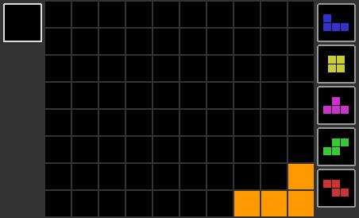

============================================================
サブコマンド: util fig
============================================================

概要
============================================================

テト譜からgifによるアニメーション画像を生成します。

テト譜の指定方法
============================================================

画像化したいテト譜のデータを field.txt に記述するか、``--tetfu`` オプションで直接指定してください。

基本コマンド
============================================================

``java -jar sfinder.jar util fig --tetfu v115@vhKSSJznBGjBXqBNpB0fBRmBasB/rB0qBAAA``

カラーテーマ
============================================================

themeディレクトリにプロパティファイルを追加すると、`--color` で指定できるようになります。

既にあるプロパティファイルをコピーして名前を変更したうえで、直接ファイルを更新してください。

デフォルトカラーのサンプル
^^^^^^^^^^^^^^^^^^^^^^^^^^^^^^^^^^^^^^^^^^^^^^^^^^^^^^^^^^^^^

.. |fig_sample_default| image:: img/fig/sample_default.gif
   :scale: 50
.. |fig_sample_mipi| image:: img/fig/sample_mipi.gif
   :scale: 50

.. |fig_sample_four| image:: img/fig/sample_four.gif
   :scale: 50

**default** : ``mipi`` をベースにライン消去・操作ミノが強調されるようなカラーリング

|fig_sample_default|

**mipi** : `@mipi_teto_puyo <https://twitter.com/mipi_teto_puyo>`_ さんの資料をベースとしたカラーリング

|fig_sample_mipi|

**fumen** : `連続テト譜エディタ <http://fumen.zui.jp/>`_ をベースとしたカラーリング

|fig_sample_fumen|

**four** : `FOUR <https://four.lol/>`_ をベースとしたカラーリング

|fig_sample_four|

プロパティファイルの構成
^^^^^^^^^^^^^^^^^^^^^^^^^^^^^^^^^^^^^^^^^^^^^^^^^^^^^^^^^^^^^

カラーテーマのプロパティは、以下のルールを基に色を設定します。

*ブロック・ライン*

* ``T,I,O,S,Z,L,J,Gray``: 各ブロックの色
* ``Gray``: せり上がりブロックの色
* ``Empty``: 空白の色
* ``Border``: ブロックまわりの線の色
* ``SideFrame``: フィールド左右のフレームの色
* ``BoxFrame``: ホールド・ネクストボックスの枠の色

*適用されるタイミング*

* ``.normal``: 通常時のブロックの色
* ``.clear``: ラインが揃ったときに強調するための色
* ``.piece``: 操作しているミノを強調するための色

オプション一覧
============================================================

======== ====================== ======================
short    long                   default
======== ====================== ======================
``-o``   ``--output``           output/fig.gif
``-F``   ``--format``           gif
``-n``   ``--next``             5
``-d``   ``--delay``            30
``-L``   ``--loop``             true
``-t``   ``--tetfu``            なし
``-s``   ``--start``            1
``-e``   ``--end``              -1
``-l``   ``--line``             -1
``-f``   ``--frame``            basic
``-c``   ``--color``            default
``-H``   ``--hold``             visible
``-lp``  ``--log-path``         output/last_output.txt
``-fp``  ``--field-path``       input/field.txt
======== ====================== ======================

``-o``, ``--output`` [default: output/fig.gif]
^^^^^^^^^^^^^^^^^^^^^^^^^^^^^^^^^^^^^^^^^^^^^^^^^^^^^^^^^^^^^

出力される画像ファイルのパスを指定する。

なお、フォーマットにpngを指定した場合は ``output/{実行日時}/fig.png`` のように、ディレクトリ構成と拡張子が一部変更されます。

``-F``, ``--format`` [default: gif]
^^^^^^^^^^^^^^^^^^^^^^^^^^^^^^^^^^^^^^^^^^^^^^^^^^^^^^^^^^^^^

出力される画像ファイルのフォーマットを指定します。

対応フォーマットは次の2つです。

* gif: GIF形式のアニメーション画像を1枚生成する
* png: PNG形式の画像を各ページを個別に複数枚生成する

``-n``, ``--next`` [default: 5]
^^^^^^^^^^^^^^^^^^^^^^^^^^^^^^^^^^^^^^^^^^^^^^^^^^^^^^^^^^^^^

表示するネクストの数を指定する。

``-d``, ``--delay`` [default: 30]
^^^^^^^^^^^^^^^^^^^^^^^^^^^^^^^^^^^^^^^^^^^^^^^^^^^^^^^^^^^^^

アニメーションのフレーム間の時間を指定する。なお、単位は10ms。

従って ``-d 20`` を指定すると、1枚につき200ms表示する画像が生成される。

※ フォーマットがgifのときのみ有効となります

``-L``, ``--loop`` [default: true]
^^^^^^^^^^^^^^^^^^^^^^^^^^^^^^^^^^^^^^^^^^^^^^^^^^^^^^^^^^^^^

出力するgif画像に無限ループするメタデータを付与するかを指定する。

画像を無限ループさせたい場合は ``true`` 、無限ループさせない場合は ``false`` を指定する。

※ フォーマットがgifのときのみ有効となります

``-t``, ``--tetfu`` [default: なし]
^^^^^^^^^^^^^^^^^^^^^^^^^^^^^^^^^^^^^^^^^^^^^^^^^^^^^^^^^^^^^

画像化したいテト譜データを指定する。

オプションからテト譜データを指定する場合は ``--tetfu v115@vhAAgH`` のように指定する。

v115のテト譜データにのみ対応。

``-s``, ``--start`` [default: 1]
^^^^^^^^^^^^^^^^^^^^^^^^^^^^^^^^^^^^^^^^^^^^^^^^^^^^^^^^^^^^^

画像化を開始するテト譜データのページ番号を指定する。

``10`` を指定した場合、最初に出力される画像は10ページ目のものとなる。

``-e``, ``--end`` [default: -1]
^^^^^^^^^^^^^^^^^^^^^^^^^^^^^^^^^^^^^^^^^^^^^^^^^^^^^^^^^^^^^

画像化を終了するテト譜データのページ番号を指定する。

このオプションで指定したページが画像の最後のページとなる。

``-s 10 -e 20`` を指定した場合、10ページから20ページの計11画像となる。

なお ``-1`` を指定した場合は、テト譜の最終ページが自動的に設定される。

``-l``, ``--line`` [default: -1]
^^^^^^^^^^^^^^^^^^^^^^^^^^^^^^^^^^^^^^^^^^^^^^^^^^^^^^^^^^^^^

画像のフィールドのライン数（高さ）を指定する。

なお ``-1`` を指定した場合は ``画像化対象ページで最も高いフィールドの高さ + 1`` が自動的に設定される。

ただしネクストを表示する際に、フィールドよりも画像の高さを必要とする場合は、自動的にこの値が拡張されます。

``-f``, ``--frame`` [default: basic]
^^^^^^^^^^^^^^^^^^^^^^^^^^^^^^^^^^^^^^^^^^^^^^^^^^^^^^^^^^^^^

フレームの種類を選択する。

現在、選択できるのは以下の3種類。

* basic: フィールド左側にHold、右側にNextがある最も基本的なフレーム
* right: フィールドの右側にHold・Nextをともに配置するコンパクトなフレーム
* no: Hold・Nextを表示せず、フィールドのみを表示するフレーム

``-c``, ``--color`` [default: default]
^^^^^^^^^^^^^^^^^^^^^^^^^^^^^^^^^^^^^^^^^^^^^^^^^^^^^^^^^^^^^

使用するカラーテーマを指定します。指定された名前でthemeディレクトリ内からカラーテーマのファイル名を検索します。

``-H``, ``--hold`` [default: visible]
^^^^^^^^^^^^^^^^^^^^^^^^^^^^^^^^^^^^^^^^^^^^^^^^^^^^^^^^^^^^^

ホールドを表示させるかを指定する。

ホールドを表示させたい場合は ``visible`` 、表示させない場合は ``hidden`` を指定する。

ただしホールドを指定する場合は、テト譜にQuizが設定されている必要があります。

もし、Quizが設定されているが、Nextにその情報を使用したくない場合は ``hidden`` を指定してください。

``-lp``, ``--log-path`` [default: output/last_output.txt]
^^^^^^^^^^^^^^^^^^^^^^^^^^^^^^^^^^^^^^^^^^^^^^^^^^^^^^^^^^^^^

実行時のログを保存するファイルのパスを指定する。

``-fp``, ``--field-path`` [default: input/field.txt]
^^^^^^^^^^^^^^^^^^^^^^^^^^^^^^^^^^^^^^^^^^^^^^^^^^^^^^^^^^^^^

フィールドを定義するファイルのパスを指定する。

util figではテト譜のみ対応しています（____XXXXXX の形式で書かれたフィールドは入力できません）。
